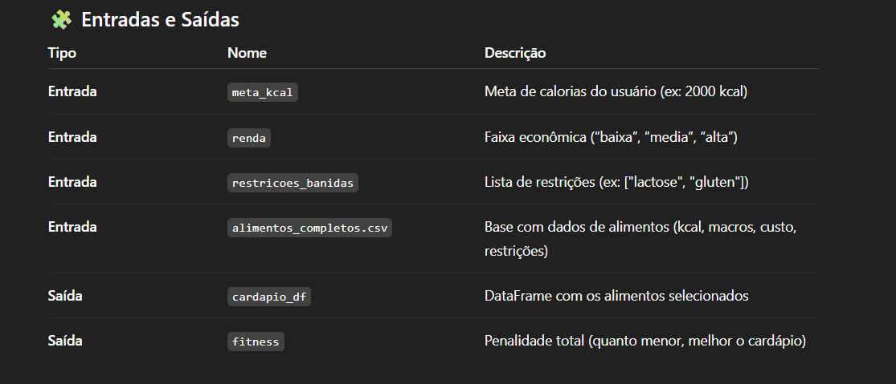
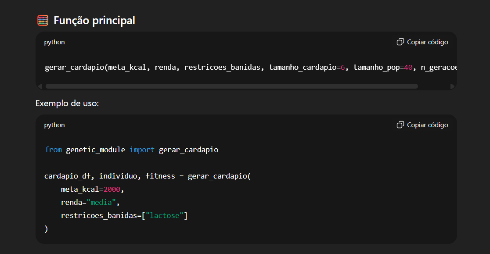
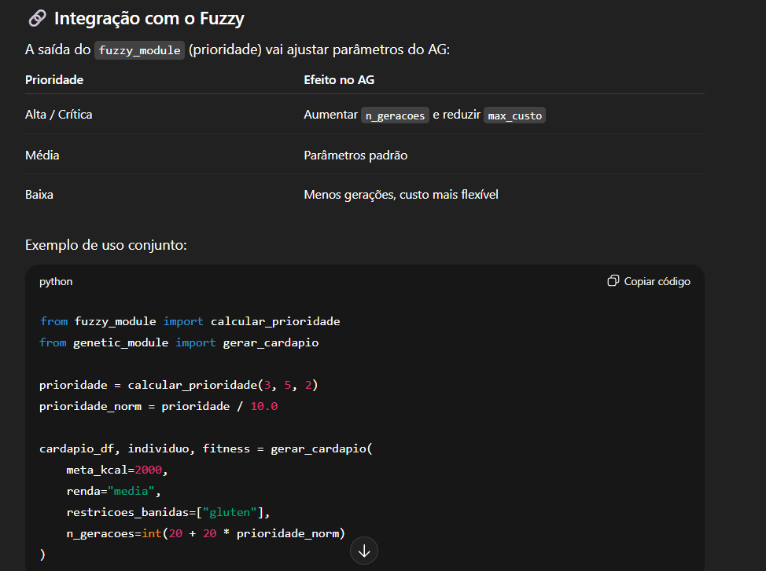

🎯 Objetivo

Gerar cardápios personalizados e otimizados com base em:
meta calórica diária,
custo máximo compatível com a renda,
restrições alimentares, e prioridade nutricional definida pelo módulo Fuzzy.
O AG busca minimizar a penalidade total de cada cardápio, simulando o processo evolutivo de seleção natural.

⚙️ Funcionamento interno

Inicialização

População inicial com n indivíduos (ex: 40), onde cada indivíduo = lista de 6 alimentos.
Função de Fitness
Avalia cada cardápio considerando:
diferença entre calorias totais e meta calórica;
custo total em relação ao limite definido pela renda;
penalização para alimentos que violem restrições;

Fórmula simplificada:
penalidade_total = pen_kcal + pen_custo + pen_restricao

Seleção
Método de torneio: escolhe os melhores cardápios para reprodução.

Cruzamento (Crossover)
Combina cardápios de dois pais trocando parte dos alimentos.

Mutação
Substitui aleatoriamente alguns alimentos para manter diversidade.

Evolução
Repete o ciclo por várias gerações (ex: 30) até encontrar a melhor solução.

Resultado final
Retorna o cardápio com menor penalidade (melhor adaptação).

