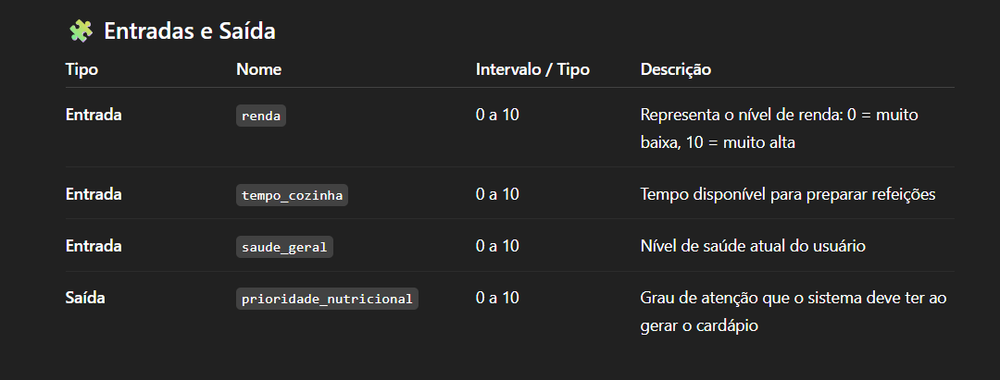
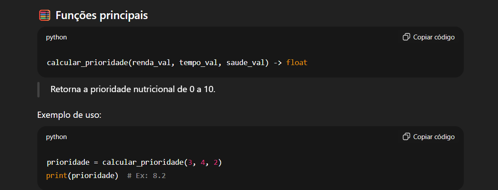

🎯 Objetivo

Implementar o sistema de Lógica Fuzzy responsável por interpretar fatores subjetivos informados pelo usuário (renda, tempo e saúde) e transformá-los em um valor numérico de prioridade nutricional, que servirá de entrada para o Algoritmo Genético.

⚙️ Funcionamento interno

Universos definidos em escala 0–10
Entradas e saída trabalham no mesmo intervalo para facilitar ajuste.

Funções de pertinência

Renda: baixa / média / alta
Tempo: pouco / médio / muito
Saúde: delicada / ok / boa
Prioridade: baixa / média / alta / crítica

Base de Regras Fuzzy
Regras do tipo SE...ENTÃO... combinam as variáveis para determinar prioridade.

Exemplo:
SE renda é baixa E tempo é pouco → prioridade é alta
SE saúde é delicada → prioridade é crítica
Inferência e Defuzzificação
Utiliza o método centroid do scikit-fuzzy para calcular o valor final (0–10).

🔗 Integração com o sistema

O valor retornado (0–10) será normalizado (0–1) e usado pelo AG para:
ajustar número de gerações
definir limite de custo
calibrar meta calórica
prioridade_norm = calcular_prioridade(renda_val, tempo_val, saude_val) / 10.0